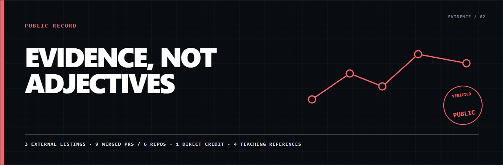
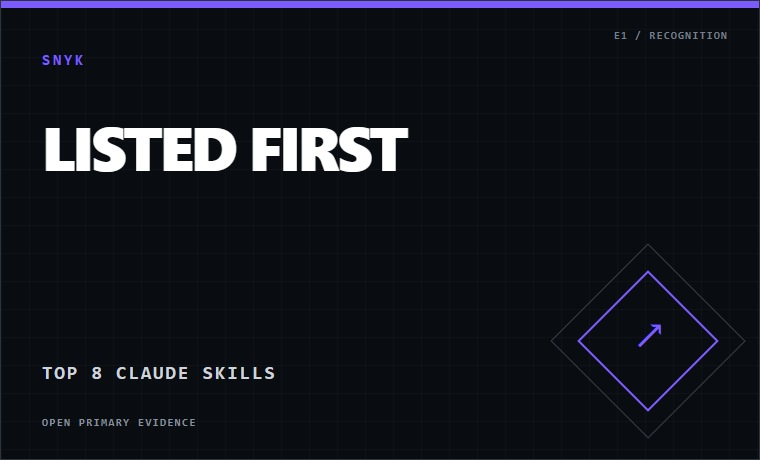
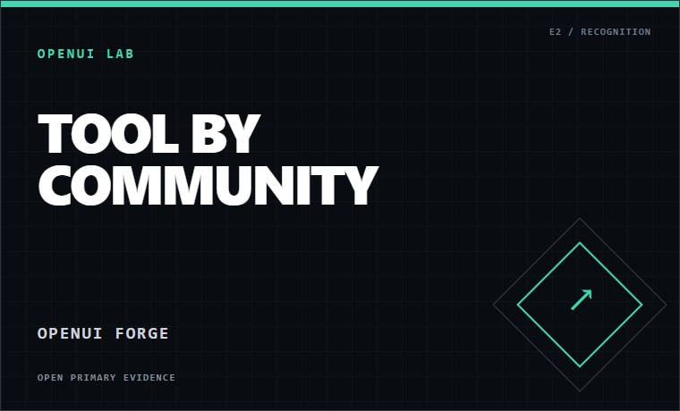
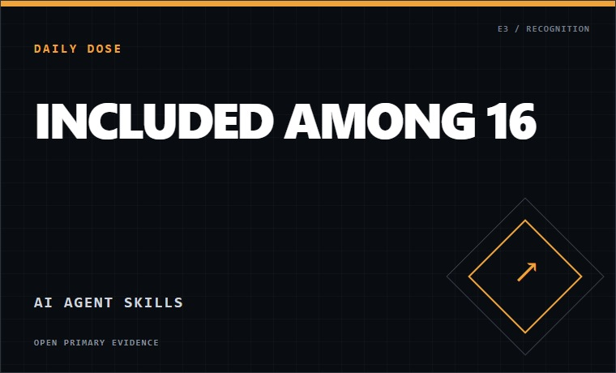

# Evidence, recognition, and contributions

This is a source record, not a wall of adjectives. Every claim below links to a
public source or is explicitly labeled as context.

**3 external listings** · **9 merged pull requests across 6 repositories** ·
**1 direct downstream credit** · **4 teaching references**

## Recognition from public sources

- **Snyk:** lists `planning-with-files` first in its Top 8 Claude Skills for Developers and marks its `SKILL.md` verified.
- **OpenUI Lab:** labels OpenUI Forge a **Tool by Community**.
- **Daily Dose of Data Science:** includes `planning-with-files` among **16 AI Agent Skills** for AI engineers.

## Nine merged upstream contributions

| Upstream | Contribution |
|---|---|
| [MemPalace/mempalace #558](https://github.com/MemPalace/mempalace/pull/558) | Safe handling of unreachable Windows reparse points. |
| [ComposioHQ/awesome-claude-skills #21](https://github.com/ComposioHQ/awesome-claude-skills/pull/21) | Added LangSmith trace retrieval for agent observability. |
| [santifer/career-ops #21](https://github.com/santifer/career-ops/pull/21) | DACH job-scanning workflow. |
| [santifer/career-ops #22](https://github.com/santifer/career-ops/pull/22) | Engineer-instructor example. |
| [santifer/career-ops #23](https://github.com/santifer/career-ops/pull/23) | German-language modes. |
| [op7418/guizang-ppt-skill #5](https://github.com/op7418/guizang-ppt-skill/pull/5) | Grid overflow and frame containment fixes. |
| [uberskillsdev/uberSKILLS #65](https://github.com/uberskillsdev/uberSKILLS/pull/65) | Windows compatibility. |
| [uberskillsdev/uberSKILLS #67](https://github.com/uberskillsdev/uberSKILLS/pull/67) | Claude Code skill-format support. |
| [buzhangsan/skill-manager #1](https://github.com/buzhangsan/skill-manager/pull/1) | Added planning and observability skills. |

## Verified downstream credit

| Repository | Connection |
|---|---|
| [jessepwj/CCteam-creator](https://github.com/jessepwj/CCteam-creator) | Explicitly credits and links `OthmanAdi/planning-with-files` as a source for its three-file planning model. |

## Related implementations, clearly separated

These projects use similarly named or Manus-derived file-planning patterns,
but their public documentation does not directly attribute
`OthmanAdi/planning-with-files`. They are not presented as verified adoption of
this repository.

| Repository | Connection |
|---|---|
| [lincolnwan/Planning-with-files-copilot-agent](https://github.com/lincolnwan/Planning-with-files-copilot-agent) | Copilot implementation of a three-file planning pattern. |
| [cooragent/ClarityFinance](https://github.com/cooragent/ClarityFinance) | Finance-agent framework using a Planning-with-Files pattern. |
| [oeftimie/vv-claude-harness](https://github.com/oeftimie/vv-claude-harness) | Claude Code harness describing an independently derived Manus-style pattern. |

## Product launch coverage

These articles document the public launch and scope of products related to my
professional work. They are product context, not evidence of individual
authorship.

- **[migRaven.MAX launch coverage](https://www.itiko.de/artikel/2195831/migraven-gmbh-lanciert-migraven-max.html)**
- **[migRaven.Archiver for Teams launch coverage](https://www.itiko.de/artikel/2145291/migraven-stellt-neuen-archiver-f-r-teams-vor.html)**
- **[aikux.Brain launch coverage](https://www.itiko.de/artikel/2209107/aikux-service-gmbh-pr-sentiert-aikux-brain-den-enterprise-knowledge-graph.html)**

## Teaching references

> “Adi has an exceptional talent for breaking down complex coding concepts into easy-to-understand lessons that were both engaging and interactive. His passion for web development is infectious, and it was clear that he genuinely cared about the success of his students.”
>
> Ivan Curmi, Finance Professional and former student

> “Adi possesses full technical proficiency in the subjects he teaches. What most impressed me was how well Adi managed the different levels of technical experience that coexisted in the same class. Adi is mindful of the needs of his students and often brings the best out of them.”
>
> João Teixeira, Software Engineer, Backend and Distributed Systems

> “The greatest instructors do more than show, or even demonstrate; they inspire. Should I ever go into teaching, the impact his lectures have made on my development journey have the energy I would hope to be able to channel into my future students.”
>
> Vernell Clark, Full Stack and Cloud Engineer

> “Bis jetzt einer der besten Coding Lehrer die ich je hatte. Jeder der bei ihm lernen kann lernt von einem der Besten.”
>
> “One of the best coding teachers I have had. Anyone who learns from him is learning from one of the best.”
>
> Romano Mantek, Junior Full Stack Developer, English translation included

More references are available on [LinkedIn](https://www.linkedin.com/in/codingwithadi).

## How this evidence is handled

Counts are a dated snapshot and repository metrics change. Rounded figures link
to live sources. “Listed first” describes source-page order, not an editorial
ranking. Last verified: 2026-08-13.

## Continue exploring

- **[Return to the profile](./Readme.md)** for the recruiter-facing overview
- **[Open the project catalogue](./PROJECTS.md)** for 35 selected public projects
