<samp>SENIOR APPLIED AI ENGINEER / BERLIN</samp>

# [`planning-with-files`](https://github.com/OthmanAdi/planning-with-files)

> **A practical open-source skill for long-running coding agents.**
>
> It keeps `task_plan.md`, `findings.md`, and `progress.md` on disk so work can continue after context loss, crashes, or compaction.

<strong>Trending achievements for <a href="https://github.com/OthmanAdi/planning-with-files">planning-with-files</a></strong>

  
  
  

  
  

  
  

  Historical rankings: daily on January 6, 2026, weekly in Week 2, 2026, monthly in January 2026, and GitHub Trending on April 21, 2026. <a href="https://trendshift.io/repositories/17191">View the achievement record.</a>

[**26K+ stars**](https://github.com/OthmanAdi/planning-with-files) · [**2.1K+ forks**](https://github.com/OthmanAdi/planning-with-files/network/members) 
[**18+ documented platforms**](https://github.com/OthmanAdi/planning-with-files/blob/master/README.md#works-across-18-platforms)

`RUST / TAURI` · `TYPESCRIPT / BUN` 
`NEO4J / GRAPHRAG`

[**LinkedIn**](https://www.linkedin.com/in/codingwithadi) · [**Email**](mailto:adiatwork@outlook.com) · [**Writing**](https://dev.to/othmanadi)

---

<h2 align="center">Currently in rotation</h2>

What I am building this week, read from my own push history and redrawn every thirty minutes.

## Four products. Four repositories.

<samp>CLICK ANY VISUAL TO OPEN ITS SOURCE</samp>

<a href="https://github.com/OthmanAdi/bunbite" title="Open the BunBite repository">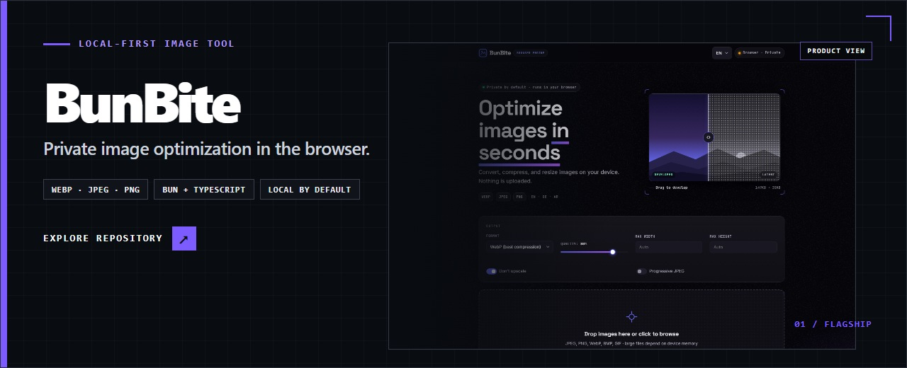</a>
<a href="https://github.com/OthmanAdi/bunbite-extension" title="Open the BunBite Studio repository">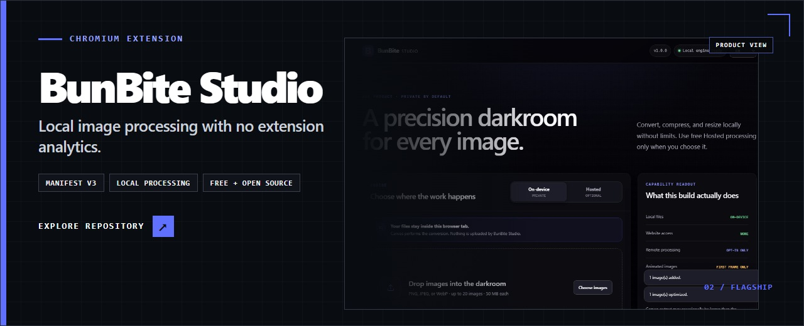</a>

<a href="https://github.com/OthmanAdi/skill-deck" title="Open the Skill Deck repository">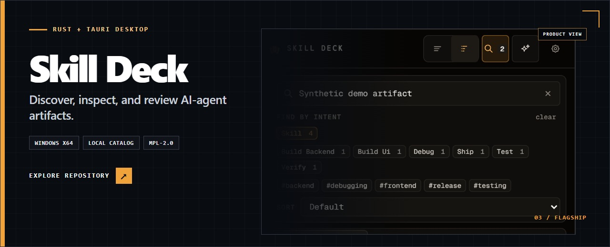</a>
<a href="https://github.com/OthmanAdi/index" title="Open the INDEX repository">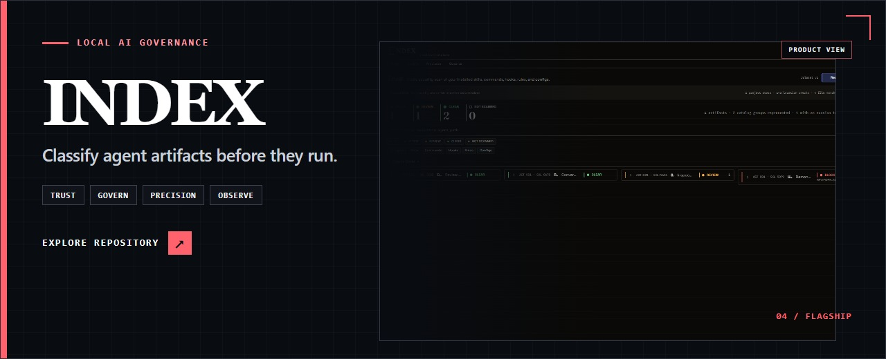</a>

## Recognition and public proof

- **[Snyk, Top 8 Claude Skills for Developers](https://snyk.io/articles/top-claude-skills-developers/):** lists `planning-with-files` first and marks its `SKILL.md` verified.
- **[OpenUI Lab](https://www.openui.com/lab):** labels OpenUI Forge a **Tool by Community**.
- **[Daily Dose of Data Science](https://blog.dailydoseofds.com/p/the-next-step-after-karpathys-wiki):** includes `planning-with-files` among **16 AI Agent Skills** for AI engineers.
- **[Merged upstream work](./PROOF.md#nine-merged-upstream-contributions):** 9 pull requests across 6 external repositories, including safe Windows reparse-point handling, agent observability, and German-language career tooling.

### [Open the source-linked evidence record →](./PROOF.md)

<h2 align="center">Impact beyond my repositories</h2>

Work credited downstream and merged into external projects.

<a href="./PROOF.md#verified-downstream-credit" title="Inspect the verified downstream credit">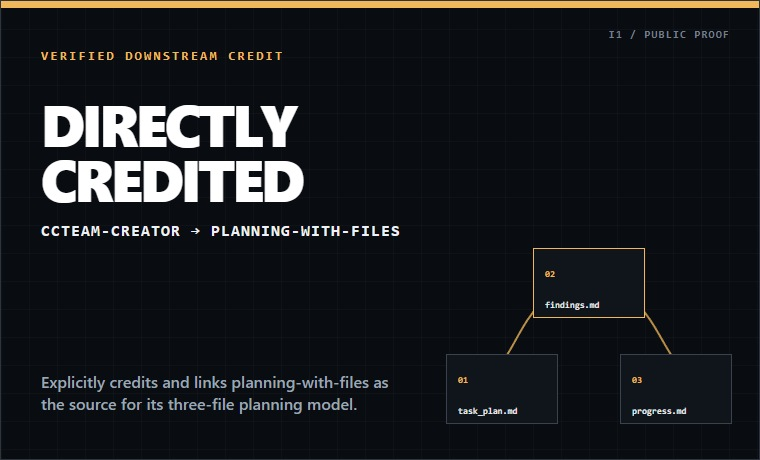</a>
<a href="./PROOF.md#nine-merged-upstream-contributions" title="Inspect nine merged upstream contributions">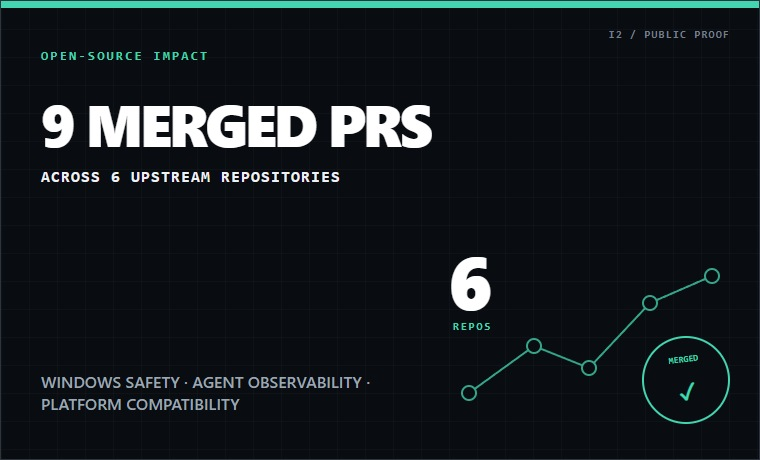</a>

- **[Verified source credit · CCteam Creator](https://github.com/jessepwj/CCteam-creator):** credits and links `planning-with-files` for its persistent three-file planning pattern.
- **[Windows filesystem safety · MemPalace #558](https://github.com/MemPalace/mempalace/pull/558):** merged handling for unreachable Windows reparse points, so scans skip inaccessible entries instead of aborting.
- **[Agent observability · awesome-claude-skills #21](https://github.com/ComposioHQ/awesome-claude-skills/pull/21):** merged LangSmith trace retrieval for debugging LangChain and LangGraph agents.
- **[Skill-format compatibility · uberSKILLS #67](https://github.com/uberskillsdev/uberSKILLS/pull/67):** merged support for importing Claude Code skills without a required `trigger` field.

### [Inspect all source-linked contributions →](./PROOF.md#nine-merged-upstream-contributions)

## Professional work

At [migRaven](https://www.migraven.com) in Berlin, I work on agent
infrastructure and graph-backed identity, data, and access systems. These public
products show the domain and systems context of that work:

- **[migRaven.MAX](https://max.migraven.com/):** identity, data, and access management with a Neo4j knowledge graph, enterprise connectors, and LLM-assisted querying
- **[aikux.Brain](https://www.aikux.ai/):** enterprise knowledge graphs, GraphRAG, and semantic access to organizational knowledge
- **[migRaven.Archiver for Teams](https://www.migraven.com/en/webinar-migraven-archiver-for-teams/):** Microsoft Teams archiving and visibility into external permissions

My role also includes internal workflow and script-orchestration systems within
migRaven.MAX.

## Engineering focus

- **Agent reliability:** persistent state, context recovery, orchestration, audit trails, and release gates that stop on failed checks
- **Local-first product engineering:** Rust, Tauri, Svelte, Bun, browser extensions, privacy boundaries, and reproducible packaging
- **Graph systems:** Neo4j, GraphRAG, identity and access graphs, checkpoints, permissions, and enterprise retrieval

## Teaching and communication

I also teach software development and AI engineering, including Python,
agent-system design, and production engineering practices. That work has shaped
how I document complex systems, explain tradeoffs, and collaborate across
different levels of technical experience.

<h2 align="center">What people say</h2>

Technical depth, clear explanations, and communication across different experience levels.

<a href="./PROOF.md#teaching-references" title="Read João Teixeira's full reference">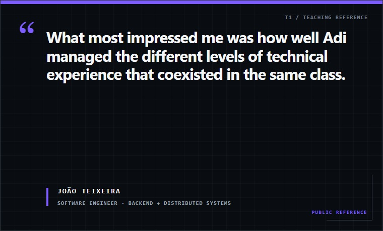</a>
<a href="./PROOF.md#teaching-references" title="Read Ivan Curmi's full reference">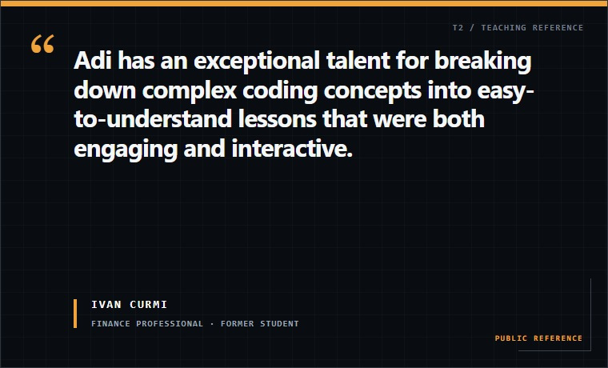</a>

### [Read all four teaching references →](./PROOF.md#teaching-references)

<h2 align="center">More systems worth opening</h2>

Agent reliability, visual planning, music control, generative UI, model routing, and knowledge graphs.

<a href="https://github.com/OthmanAdi/planning-with-files" title="Open the Planning with Files repository">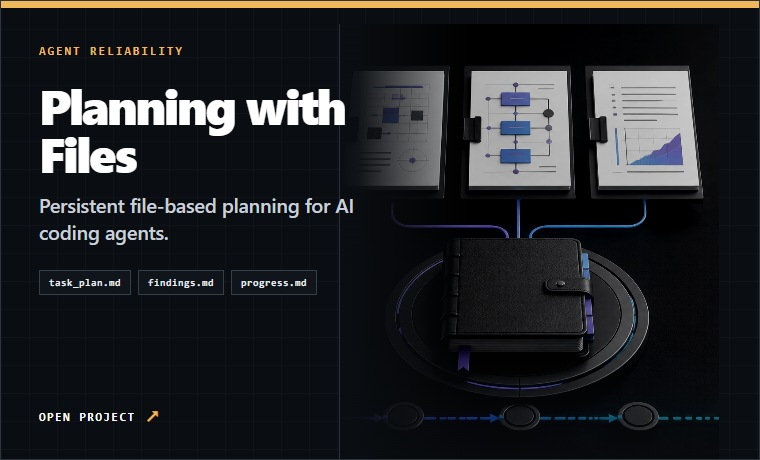</a>
<a href="https://github.com/OthmanAdi/plandeck" title="Open the Plandeck repository">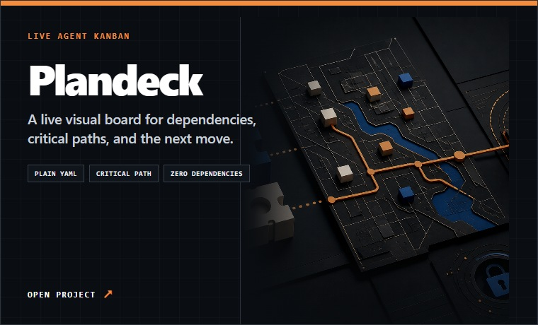</a>

<a href="https://github.com/OthmanAdi/loophole" title="Open the Loophole repository">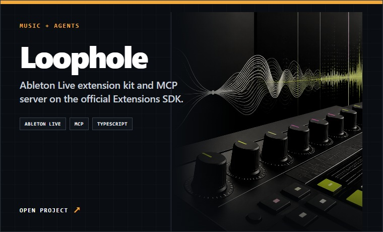</a>
<a href="https://github.com/OthmanAdi/openui-forge" title="Open the OpenUI Forge repository">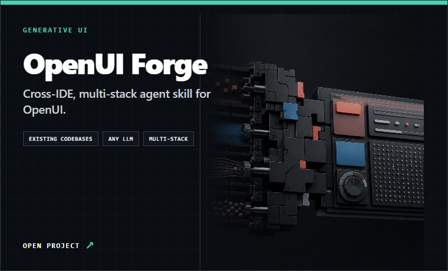</a>

<a href="https://github.com/OthmanAdi/ai-model-directory-router-rs" title="Open the AI Model Directory Router repository">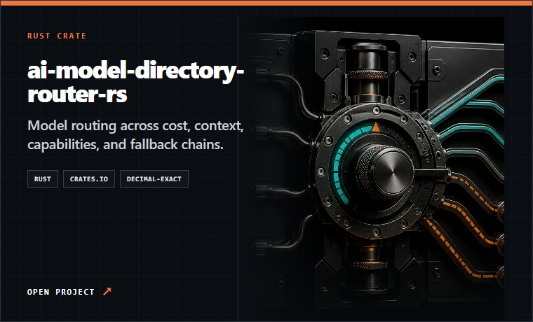</a>
<a href="https://github.com/OthmanAdi/OpenMark" title="Open the OpenMark repository">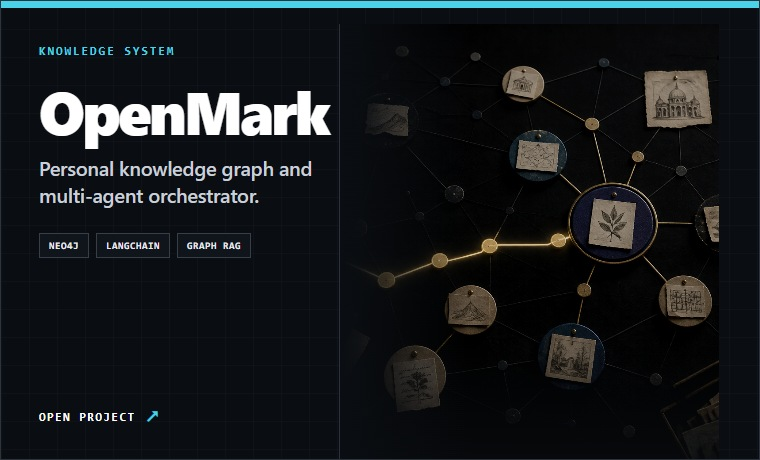</a>

## Go deeper

### [Explore 35 selected projects →](./PROJECTS.md)

Agent tooling, desktop applications, Rust systems, graph infrastructure, media
tools, and web products.

### [Inspect the public evidence →](./PROOF.md)

Recognition, direct downstream credit, related implementations, merged upstream
work, launch coverage, and teaching references.

## Contact

Berlin · [LinkedIn](https://www.linkedin.com/in/codingwithadi) · [Email](mailto:adiatwork@outlook.com) · [dev.to](https://dev.to/othmanadi)
