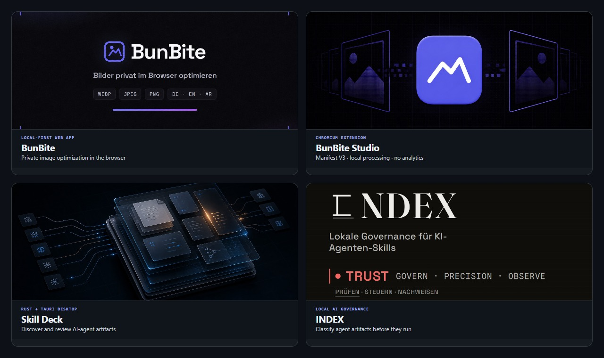

# Ahmad Othman Ammar Adi

**Senior Applied AI Engineer in Berlin.**

I build local-first developer products, AI-agent infrastructure, and
graph-backed enterprise systems with Rust, Tauri, Svelte, Bun, TypeScript, and
Neo4j.

[LinkedIn](https://www.linkedin.com/in/codingwithadi) · [Email](mailto:adiatwork@outlook.com) · [Writing](https://dev.to/othmanadi)

> **Open-source traction:** [planning-with-files](https://github.com/OthmanAdi/planning-with-files) has 26K+ stars on GitHub. 
> **External coverage:** Snyk listed it first in its Top 8 Claude Skills for Developers, and OpenUI Lab lists [openui-forge](https://github.com/OthmanAdi/openui-forge) as a community-built tool. 
> **Enterprise AI engineering:** At [migRaven](https://www.migraven.com), I work across agent infrastructure, Rust runtimes, and graph systems.

## Selected products

- **[BunBite](https://github.com/OthmanAdi/bunbite):** Free, local-first WebP, JPEG, and PNG optimization in the browser. Built with Bun, TypeScript, SQLite, and the Canvas API. [Architecture](https://github.com/OthmanAdi/bunbite#architektur)
- **[BunBite Studio](https://github.com/OthmanAdi/bunbite-extension):** Chromium Manifest V3 extension for local image optimization, with no access to page content and no extension analytics. [v1.0.0 prerelease](https://github.com/OthmanAdi/bunbite-extension/releases/tag/v1.0.0)
- **[Skill Deck](https://github.com/OthmanAdi/skill-deck):** Windows desktop workbench that discovers and catalogs AI-agent artifacts for search and manual review. Built with Rust, Tauri, and Svelte. [English overview](https://github.com/OthmanAdi/skill-deck/blob/master/README.en.md)
- **[INDEX](https://github.com/OthmanAdi/index):** Local governance and risk classification for supported skills, rules, hooks, commands, and configuration, with CLEAR, REVIEW, BLOCK, and NOT SCANNED outcomes. [English overview](https://github.com/OthmanAdi/index/blob/main/README.en.md)

## Recognition and open-source contributions

- **[Snyk, Top 8 Claude Skills for Developers](https://snyk.io/articles/top-claude-skills-developers/):** lists `planning-with-files` first in its selection.
- **[OpenUI Lab](https://www.openui.com/lab):** lists `openui-forge` as a community-built tool for wiring OpenUI integrations across common AI stacks.
- **[Daily Dose of Data Science](https://blog.dailydoseofds.com/p/the-next-step-after-karpathys-wiki):** includes `planning-with-files` among 16 AI Agent Skills for AI engineers.
- **Merged upstream contributions:** include safe Windows reparse-point handling for [MemPalace](https://github.com/MemPalace/mempalace/pull/558), AI-observability tooling for [awesome-claude-skills](https://github.com/ComposioHQ/awesome-claude-skills/pull/21), and DACH and German-language features for [career-ops](https://github.com/santifer/career-ops/pull/21).

[See supporting public evidence and contribution records](./PROOF.md)

## Professional work

At [migRaven](https://www.migraven.com) in Berlin, I work on agent
infrastructure and graph-backed identity, data, and access systems. These public
products show the domain and systems context of that work:

- **[migRaven.MAX](https://max.migraven.com/):** Identity, data, and access management with a Neo4j knowledge graph, enterprise connectors, and LLM-assisted querying.
- **[aikux.Brain](https://www.aikux.ai/):** Enterprise knowledge graphs, GraphRAG, and semantic access to organizational knowledge.
- **[migRaven.Archiver for Teams](https://www.migraven.com/en/webinar-migraven-archiver-for-teams/):** Microsoft Teams archiving and visibility into external permissions.

My role also includes internal workflow and script-orchestration systems within
migRaven.MAX.

## Engineering focus

- **Agent reliability:** persistent state, context recovery, orchestration, audit trails, and release gates that stop on failed checks.
- **Local-first product engineering:** Rust, Tauri, Svelte, Bun, browser extensions, privacy boundaries, and reproducible packaging.
- **Graph systems:** Neo4j, GraphRAG, identity and access graphs, checkpoints, permissions, and enterprise retrieval.

## Teaching and communication

I also teach software development and AI engineering, including Python,
agent-system design, and production engineering practices. That work has shaped
how I document complex systems, explain tradeoffs, and collaborate across
different levels of technical experience.

[Selected teaching references](./PROOF.md#teaching-and-communication)

## More work and evidence

- **[Project catalogue](./PROJECTS.md):** selected agent tooling, desktop apps, Rust systems, graph infrastructure, and web products
- **[Evidence and contributions](./PROOF.md):** external coverage, direct downstream credit, related implementations, merged upstream work, and teaching references

## Contact

Berlin · [LinkedIn](https://www.linkedin.com/in/codingwithadi) · [Email](mailto:adiatwork@outlook.com) · [dev.to](https://dev.to/othmanadi)
